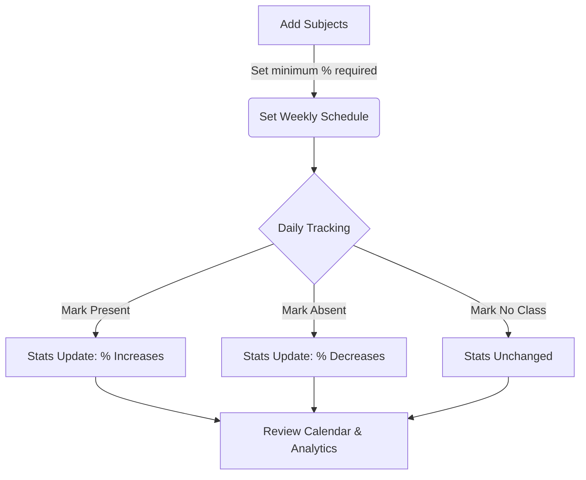

<div align="center">

# 🎓 Attendance Tracker

**A beautiful, modern Android application for effortlessly tracking and managing your class attendance.**

[](https://github.com/hrishikeshp7/Self-Attendance-Tracker/actions/workflows/build-release.yml)
[](https://kotlinlang.org/)
[](https://developer.android.com/jetpack/compose)
[](https://m3.material.io/)
[](https://opensource.org/licenses/MIT)

*Built with Kotlin, Jetpack Compose, and Room Database. Entirely vibe-coded with AI as a test project.*

</div>

<br />

## 🌟 Overview

Attendance Tracker helps students keep track of their daily attendance, ensuring they meet their required attendance criteria without any stress. With an intuitive interface, it provides deep insights, monthly calendar views, and smart scheduling.

---

## 🚀 How It Works



1. **Setup**: Add your subjects and define the minimum required attendance (e.g., 75%).
2. **Schedule**: Configure which subjects happen on which days.
3. **Track**: Mark your daily attendance straight from the Home screen.
4. **Review**: Check your calendar history and overall statistics at a glance.

---

## ✨ Key Features

| Feature | Description |
| :--- | :--- |
| 📊 **Home Dashboard** | View all subjects with visual pie charts showing attendance percentage. Mark attendance quickly (Present / Absent / No Class). |
| 📅 **Calendar History** | Monthly calendar with color-coded days (🟢 Present, 🔴 Absent, ⚫ No Class) to easily review your history. |
| 📚 **Subject Management** | Add custom subjects, edit lecture counts, and set individual required attendance percentages. |
| 📆 **Smart Scheduling** | Toggle which subjects occur on specific days of the week to streamline your daily tracking. |
| 🎨 **Material 3 & Dark Mode** | Gorgeous dynamic colors (Android 12+) with seamless dark mode support based on system settings. |

---

## 🛠 Tech Stack

- **Language**: Kotlin
- **UI Framework**: Jetpack Compose (Material 3)
- **Database**: Room (SQLite)
- **Architecture**: MVVM (Model-View-ViewModel)
- **Navigation**: Jetpack Navigation Compose
- **SDK**: Min 26 (Android 8.0) / Target 36 (Android 16)

---

## 🏗 Building the Project

### Prerequisites
- Android Studio Hedgehog (or newer)
- JDK 17
- Android SDK 36

### Quick Start
```bash
# Clone the repository
git clone https://github.com/hrishikeshp7/Self-Attendance-Tracker.git
cd Self-Attendance-Tracker

# Build and run a debug APK
./gradlew assembleDebug
```

<details>
<summary><b>📦 Release Builds & Keystore Setup (Click to expand)</b></summary>
<br/>
To ensure that users can upgrade between releases without conflicts, all release builds must be signed with the same keystore.

#### For Repository Maintainers (GitHub Actions)
1. Generate a keystore file:
   ```bash
   keytool -genkeypair -v -keystore release.keystore -alias release \
     -keyalg RSA -keysize 2048 -validity 10000 \
     -storepass YourSecurePassword -keypass YourSecureKeyPassword
   ```
2. Encode to base64:
   ```bash
   base64 release.keystore > release.keystore.base64
   ```
3. Add GitHub Secrets:
   - `RELEASE_KEYSTORE_BASE64`
   - `RELEASE_KEYSTORE_PASSWORD`
   - `RELEASE_KEY_ALIAS`
   - `RELEASE_KEY_PASSWORD`

#### For Local Release Builds
```bash
export KEYSTORE_FILE=path/to/release.keystore
export KEYSTORE_PASSWORD=your_password
export KEY_ALIAS=release
export KEY_PASSWORD=your_key_password

./gradlew assembleRelease
```
</details>

---

## 📂 Project Structure

```text
app/src/main/java/com/attendance/tracker/
├── data/
│   ├── database/    # Room DB, DAOs, Type Converters
│   ├── model/       # Data Models (Subject, AttendanceRecord, ScheduleEntry)
│   └── repository/  # Single source of truth for data access
├── ui/
│   ├── components/  # Reusable UI elements (SubjectCard, CalendarView)
│   ├── screens/     # App screens (Home, Calendar, Subjects, Schedule, Settings)
│   └── theme/       # Material 3 Theme, Colors, Typography
└── MainActivity.kt  # Entry point
```

---

## 📥 Download

Grab the latest compiled APK from the [Releases page](https://github.com/hrishikeshp7/Self-Attendance-Tracker/releases).

---

## 📝 License & Author

Made with ❤️ by [hrishikeshp7](https://github.com/hrishikeshp7)

This project is open-source and available under the [MIT License](LICENSE).
